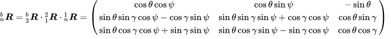

参考：https://zhuanlan.zhihu.com/p/36371959



于是
```
def outputAngle(rmat):
    rmat = rmat.T
    thetaz = math.atan2(rmat[1,0], rmat[0,0])
    thetay = math.atan2(-1 * rmat[2,0], math.sqrt(rmat[2,1]*rmat[2,1] + rmat[2,2]*rmat[2,2]))
    thetax = math.atan2(rmat[2,1], rmat[2,2])
```